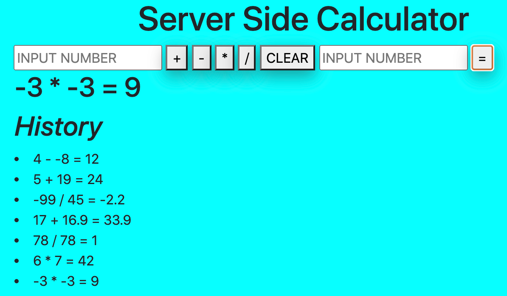

# jQuery Server Side Calculator

## Description

_Duration: 15 hrs_

This is a calculator that lives on a server. Because it is accessed indirectly by us. It can store our old calculations

This program creates a history so that we know which problems we have completed and have a showcase of our work.

A history of all calculations lives on the server. At User's whim, she can query the server for this history which will be displayed on her web browser. 

### Prerequisites

- [Node.js](https://nodejs.org/en/)
- List other prerequisites here

## Installation
1.Fork the public repository, https://github.com/JoelleKado/jquery-server-side-calculator.git.
2. Clone the forked repo to your local machine.
3. Open up your downloaded repo and run the following commands in terminal:
-`npm init -y`
-`npm install`
-`npm install express`

## Usage

1. Start the server:
-(In terminal) `npm start`
2. Open web browser and go to http://localhost:5000/.

3. Input numbers into the two input fields, select an operator and press `=` to send your expression to the server for calculation. Your answer will be returned on screen.

4. Press `CLEAR` to clear the input fields.

5. A history of your math equations are displayed on screen.

## Acknowledgement
Thanks to [Prime Digital Academy](www.primeacademy.io) who equipped and helped me to make this application a reality. Thank you https://github.com/MalikElate, for working alongside me during this project.

## Support
If you have suggestions, comments, or need help; please email me at [jkado@my.hpu.edu](www.google.com)
